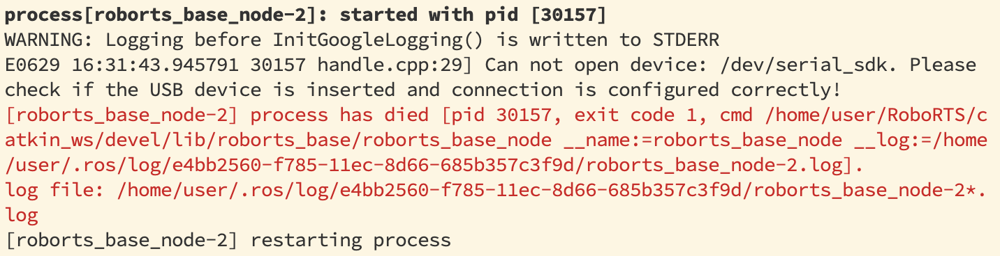
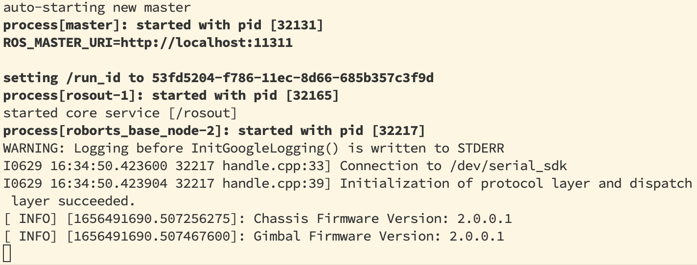

[CLICK ME TO GO TO MAIN PAGE](../README.md#table-of-content-dev-notes)

# roslaunch roborts_bringup base.launch
- Use your own computer (ROS) to control the standard robot, by publishing to the topic `cmd_vel` 
- Test was carried out on: RoboMaster AI Robot 2020 Standard Version 
- Publish to cmd_vel: `rosrun teleop_twist_keyboard_cpp teleop_twist_keyboard` OR [move_vel.cpp](src/roborts_move/src/move_vel.cpp)

## Possible problems you might face
**1. Cannot open device**

- Analysis:
  - The name of serial_sdk was given by: 
    - roborts.rules 
      - Under `src/roborts_bringup/scripts/udev/` 
      - It gives an entry point for access, by specifying vendor ID and product ID of that usb device (the stm32 board in this case). And links the specific device to the name, serial_sdk .
      - Extra info: user-defined udev rules are usually written to `/etc/udev/rules.d` 
    - roborts_base_parameter.yaml 
      - A parameter file to give the definition of “serial_port” 
- Solution:
  - Make sure that the stm32 board was connected to the computer (your ros machine: jetson nano / minipc) 

**2. Session 2 & 3 error**

- Analysis:
  - It is an error when running the protocol.cpp under `src/roborts_base/roborts_sdk/protocol/` 
  - You might face this error if mistakenly connecting the usb serial to the gimble stm32 board .
- Solution:
  - Make sure the usb is connected to the serial of the robot_base stm32 board.
  
**3. No response after publishing to cmd_vel**

- Analysis:
  - Please refer to ”RoboMaster AI Robot User Manel”: 
    - English version (pp. 22): https://rm-static.djicdn.com/tem/17348/RoboMasterAI%20Robot%202020%20Standard%20Version%20User%20Manual%20v2.pdf  
    - Chinese version (pp. 21): https://rm-static.djicdn.com/tem/17348/RoboMaster%20AI%E6%9C%BA%E5%99%A8%E4%BA%BA%202020%E6%A0%87%E5%87%86%E7%89%88%20%E7%94%A8%E6%88%B7%E6%89%8B%E5%86%8Cv2.pdf 
- Solution:
  - Make sure that the DJI controller was paired up with the standard robot. 
  - The S1 switch (the switch on the right of the controller) shall be at the position –3 (flicked down), such that the robot will be at automated control mode. 
